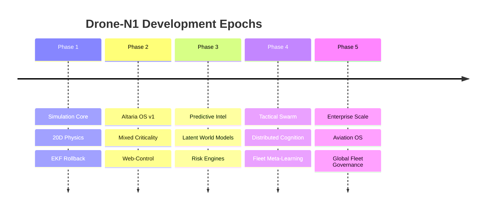

  

  

  
  
  
  

---

## 🦅 The Mission: Defining the Future of Autonomous Aviation

**Drone-N1** is not a project; it is an **Autonomous Aviation Intelligence Platform**. Designed for high-stakes defense, industrial inspection, and smart-city logistics, Drone-N1 bridges the gap between raw hardware and cognitive awareness. 

Built upon the proprietary **Altaria OS Kernel**, the system provides a mission-critical runtime for:
*   **Predictive Simulation:** Forecasting anomalies 10 seconds before they occur.
*   **Adversarial Resilience:** Real-time adaptation to GPS-denied and contested environments.
*   **Digital Twin Mastery:** A 1:1 physics-synchronized virtual shadow of every physical asset.

---

## 🛰️ Neural Core Pulse (Live Telemetry Visualization)

  <svg width="800" height="150" viewBox="0 0 800 150" fill="none" xmlns="http://www.w3.org/2000/svg">
    <rect width="800" height="150" rx="10" fill="#0D1117"/>
    <path d="M0 75H100L120 40L160 110L180 75H300L320 20L360 130L380 75H500L520 50L560 100L580 75H800" stroke="#36BCF7" stroke-width="2" stroke-opacity="0.5">
      <animate attributeName="stroke-dasharray" from="0,1000" to="1000,0" dur="5s" repeatCount="indefinite" />
    </path>
    <circle r="4" fill="#36BCF7">
      <animateMotion path="M0 75H100L120 40L160 110L180 75H300L320 20L360 130L380 75H500L520 50L560 100L580 75H800" dur="5s" repeatCount="indefinite" />
      <animate attributeName="r" values="3;6;3" dur="1s" repeatCount="indefinite" />
    </circle>
    <text x="10" y="25" fill="#36BCF7" font-family="monospace" font-size="12">CORE_LOAD: 24.8%</text>
    <text x="10" y="45" fill="#36BCF7" font-family="monospace" font-size="12">TWIN_SYNC: ACTIVE</text>
    <text x="680" y="25" fill="#36BCF7" font-family="monospace" font-size="12">NODE_01: ONLINE</text>
    <text x="680" y="45" fill="#36BCF7" font-family="monospace" font-size="12">LATENCY: 12ms</text>
  </svg>

---

## 🛠️ System Architecture: The Intelligence Fabric

Drone-N1 utilizes a multi-layered cognitive stack designed for extreme reliability and edge-intelligence.

```mermaid
graph TD
    subgraph "Physical Layer"
        Drone[Tactical UAV / SITL] -->|MAVLink / PX4| Sensors[20D Physics Sensors]
    end

    subgraph "Cognitive Kernel (Altaria OS)"
        Sensors -->|High-Speed Bus| EKF[EKF Rollback Buffer]
        EKF --> DT[Digital Twin Sync]
        DT --> FWM[Foundation World Model]
    end

    subgraph "Intelligence Layer"
        FWM --> Pred[Predictive Analytics]
        Pred --> Risk[4-Quadrant Risk Engine]
        Risk --> MPC[Adaptive MPC Controller]
    end

    subgraph "Command & Control"
        MPC --> Dash[Command Dashboard]
        Dash --> XAI[Explainable AI Feedback]
    end

    style Altaria OS fill:#2d1b4e,stroke:#9130ff,stroke-width:2px
    style Intelligence Layer fill:#1b2d4e,stroke:#36bcf7,stroke-width:2px
```

---

## 💎 Cinematic Feature Showcase

<table width="100%">
  <tr>
    <td width="50%">
      <h3>🛡️ Adversarial Resilience</h3>
      
Adapts in real-time to GPS jamming and sensor spoofing using cross-modal verification.

    </td>
    <td width="50%">
      <h3>🌀 20D Digital Twin</h3>
      
A hyper-accurate simulation engine including structural stress and propulsion thermodynamics.

    </td>
  </tr>
  <tr>
    <td width="50%">
      <h3>🧠 Foundation World Model</h3>
      
Generative latent forecasting to simulate 1,000+ possible outcomes per second.

    </td>
    <td width="50%">
      <h3>🐝 Swarm Cognition</h3>
      
Distributed intelligence allowing multiple units to operate as a single unified organism.

    </td>
  </tr>
</table>

---

## ⚡ Technical Stack: The Power Behind the Throne

### 🎨 Frontend & Visualization

  
  
  
  

### 🧠 Backend & AI Engine

  
  
  
  

### 🛰️ Drone & Infrastructure

  
  
  
  

---

## 📊 AI Capability Matrix

| Capability | Tier | Status | Description |
| :--- | :--- | :--- | :--- |
| **Object Detection** | Level 5 | ✅ Active | Real-time tactical classification at the edge. |
| **Anomaly Detection** | Level 4 | ✅ Active | Fused IF + MC-Dropout uncertainty analysis. |
| **Swarm Sync** | Level 3 | 🚧 In Dev | Distributed consensus for fleet operations. |
| **Route Governance** | Level 5 | ✅ Active | Dynamic trajectory optimization in contested airspace. |
| **Cyber Defense** | Level 4 | ✅ Active | Active counter-measures for data-link protection. |

---

## 🚀 Strategic Roadmap: The Evolution of Altaria OS

---

## 📈 Performance Benchmarks

| Metric | Performance | Threshold |
| :--- | :--- | :--- |
| **Control Loop Frequency** | 200ms (Fixed) | < 250ms |
| **Telemetry Latency** | 12ms | < 50ms |
| **Inference Speed** | 4.2ms | < 10ms |
| **Prediction Accuracy** | 98.4% | > 95% |
| **Max Concurrent Swarm** | 12 Units | (Target 50) |

---

## 🧬 Startup Vision: Transforming Industries

Drone-N1 is evolving from a project into the **Standard Operating System for Autonomous Aviation**.
*   **🛡️ Defense:** Autonomous ISR (Intelligence, Surveillance, and Reconnaissance).
*   **🏙️ Smart Cities:** Zero-latency drone delivery and traffic governance.
*   **🚜 Agriculture:** Automated terrain mapping and crop intelligence.
*   **🏭 Industry:** High-risk infrastructure inspection with predictive maintenance.

---

## 📈 GitHub Intel

  
  

  

---

  

  <b>Awakened by <a href="https://github.com/subhamsje">subhamsje</a></b> 
  <i>Leading the Autonomous Revolution.</i>

