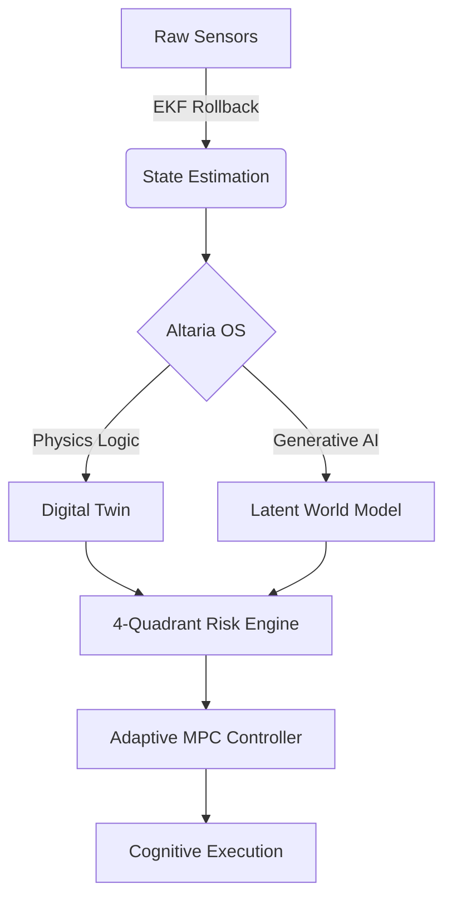

<p align="center">
  
</p>

# <p align="center">🛰️ DRONE-N1: THE COGNITIVE REVOLUTION</p>

<p align="center">
  
</p>

<p align="center">
  <b>The World's First Hybrid Digital Twin powered by the Altaria OS Kernel.</b>
</p>

<p align="center">
  <a href="https://github.com/subhamsje/Drone-N1/stargazers"></a>
  <a href="https://github.com/subhamsje/Drone-N1/network/members"></a>
  <a href="https://opensource.org/licenses/MIT"></a>
</p>

---

## 🌌 Neural Core Pulse

<p align="center">
  <svg width="600" height="100" viewBox="0 0 600 100" fill="none" xmlns="http://www.w3.org/2000/svg">
    <path d="M0 50H150L170 30L210 70L230 50H350L370 20L410 80L430 50H600" stroke="#36BCF7" stroke-width="2" stroke-dasharray="1000" stroke-dashoffset="1000">
      <animate attributeName="stroke-dashoffset" from="1000" to="0" dur="3s" repeatCount="indefinite" />
    </path>
    <circle cx="0" cy="50" r="3" fill="#36BCF7">
      <animateMotion path="M0 50H150L170 30L210 70L230 50H350L370 20L410 80L430 50H600" dur="3s" repeatCount="indefinite" />
    </circle>
  </svg>
</p>

---

## 🌌 Overview

**Drone-N1** is an autonomous cognitive organism. Built on the **Altaria OS**, it merges high-fidelity nonlinear physics with deep generative world models.

### 💎 The "Wow" Factor
*   **🧠 Meta-Cognition:** Real-time self-monitoring and strategic evolution.
*   **🌀 20D Physics:** aerodynamic, structural, and propulsion integration.
*   **🔮 Latent Forecasting:** Predicting the future 10 seconds ahead.

---

## 🛠️ Intelligence Pipeline



---

## 🚀 How to Run

### 1. 📋 Prerequisites
*   Python 3.10+ | Node.js v18+

### 2. 🧠 Launch the Backend
```bash
python -m venv venv && source venv/bin/activate
pip install -r requirements.txt
python main.py --demo
```

### 🎨 Launch the Frontend
```bash
cd frontend && npm install && npm run dev
```

---

## 🧬 Technical Stack

| Tech | Purpose |
| :--- | :--- |
| **Altaria OS** | Mixed-Criticality Kernel |
| **NumPy/SciPy** | Nonlinear Physics |
| **PyTorch** | Latent World Models |
| **Three.js** | 3D Visualization |

---

<p align="center">
  <b>Designed & Developed by <a href="https://github.com/subhamsje">subhamsje</a></b>
</p>
