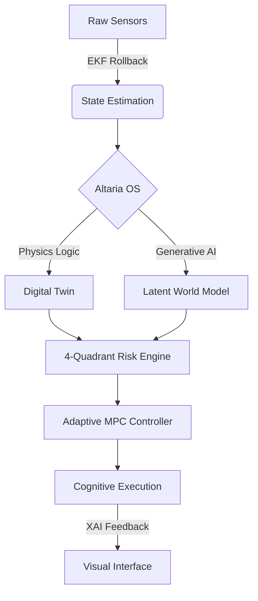

<p align="center">
  
</p>

# <p align="center">🛰️ DRONE-N1: THE COGNITIVE REVOLUTION</p>

<p align="center">
  <b>The World's First Hybrid Digital Twin powered by the Altaria OS Kernel.</b>
</p>

<p align="center">
  <a href="https://github.com/subhamsje/Drone-N1/stargazers"></a>
  <a href="https://github.com/subhamsje/Drone-N1/network/members"></a>
  <a href="https://github.com/subhamsje/Drone-N1/issues"></a>
  <a href="https://opensource.org/licenses/MIT"></a>
</p>

---

## 🌌 Overview

**Drone-N1** isn't just a flight controller; it's an autonomous cognitive organism. Built on the **Altaria OS**, it merges high-fidelity nonlinear physics with deep generative world models to achieve a level of situational awareness previously reserved for advanced aerospace laboratories.

### 💎 The "Wow" Factor
*   **20D Nonlinear Physics Engine:** Real-time integration of aerodynamics, structural dynamics, and propulsion.
*   **Latent Generative Forecasting:** Predicting the future 10 seconds ahead using uncertainty-aware LSTM manifolds.
*   **Altaria OS Kernel:** A mixed-criticality runtime that ensures safety even when cognitive systems are pushed to the limit.

---

## 🛠️ System Architecture

The **Intelligence Pipeline** is a closed-loop mastery of data and action:



---

## 🕹️ Interactive Interface

The project includes a **Cyber-Cognitive Dashboard** that streams live telemetry via high-speed WebSockets. It provides:
*   **Neural Heatmaps:** Visualizing decision-making confidence.
*   **Risk Quadrants:** Real-time survival probability monitoring.
*   **Swarm Telemetry:** Unified control for distributed drone fleets.

---

## 🚀 How to Run

Follow these steps to awaken the Drone-N1 system on your local machine.

### 1. 📋 Prerequisites
*   **Python:** 3.10 or higher
*   **Node.js:** v18+ (for the frontend)
*   **Git:** To clone and manage the core.

### 2. 🧬 Clone the Neural Core
```bash
git clone https://github.com/subhamsje/Drone-N1.git
cd Drone-N1
```

### 3. 🧠 Initialize the Backend (Brain)
The backend handles the physics, EKF, and AI forecasting.
```bash
# Create and activate a virtual environment
python -m venv venv
source venv/bin/activate  # On Windows: venv\Scripts\activate

# Install dependencies
pip install -r requirements.txt

# Launch the Cognitive Engine
python main.py
```
*   *Add `--demo` to trigger a simulated sensor failure and see the system's recovery in action.*

### 🎨 Initialize the Frontend (Vision)
The frontend provides the high-performance visualization dashboard.
```bash
cd frontend
npm install
npm run dev
```
*   *Open `http://localhost:3000` to view the live telemetry stream.*

---

## 🧬 Technical Stack

| Component | Technology |
| :--- | :--- |
| **Cognitive OS** | Altaria OS (Mixed-Criticality Kernel) |
| **Mathematics** | NumPy, SciPy (Nonlinear Physics & EKF) |
| **Deep Learning** | PyTorch / TensorFlow (Latent World Models) |
| **Data Stream** | High-speed WebSockets (JSON-L) |
| **Visualization** | React + Three.js + Canvas Rendering |

---

## 🤝 Contributing

We are building the future of autonomy. If you have ideas for the Altaria OS or the Digital Twin engine:
1.  Fork the Project
2.  Create your Feature Branch (`git checkout -b feature/AmazingFeature`)
3.  Commit your Changes (`git commit -m 'Add some AmazingFeature'`)
4.  Push to the Branch (`git push origin feature/AmazingFeature`)
5.  Open a Pull Request

---

<p align="center">
  Built with passion for the next frontier of robotics. <br>
  <b>Designed & Developed by <a href="https://github.com/subhamsje">subhamsje</a></b>
</p>
