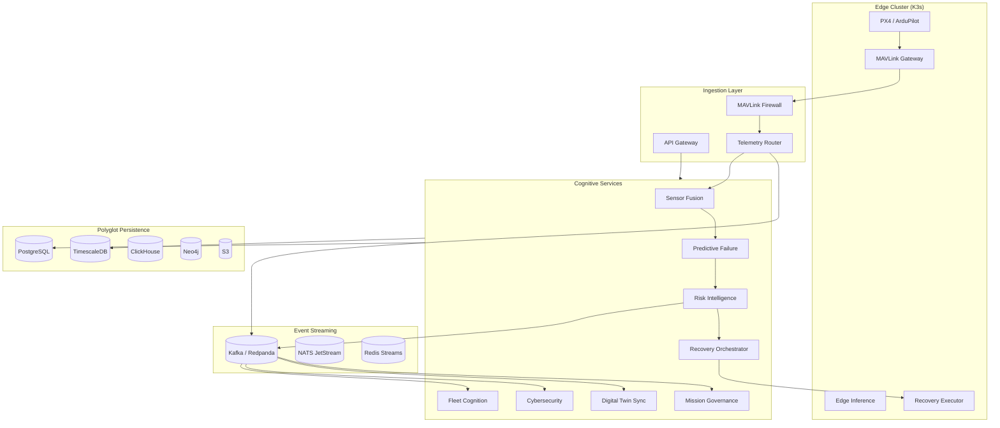

# Altaria N1 — Distributed Autonomous UAV Cognitive Backend

> Military-grade, event-driven, low-latency backend for AI-native aerial intelligence.

---

## 1. System Overview

The backend behaves as a **distributed autonomous nervous system**: ingesting high-frequency telemetry, fusing state, running AI inference, scoring risk, executing recovery workflows, and synchronizing edge/cloud intelligence across fleets.



---

## 2. Distributed Topology

| Zone | Components | Latency Target |
|------|------------|----------------|
| **Edge (per UAV)** | MAVLink gateway, local inference, recovery executor, Redis cache | < 50ms decision |
| **Regional** | Kafka brokers, sensor fusion, risk scoring | < 100ms |
| **Cloud** | Fleet cognition, MLOps, digital twin replay, analytics | < 500ms |
| **Global** | Multi-region API gateway, model registry, DR replicas | HA 99.99% |

---

## 3. Service Catalog

| Service | Language | Responsibility |
|---------|----------|----------------|
| `api-gateway` | Python/FastAPI | REST, WebSocket, auth, rate limiting |
| `mavlink-gateway` | Rust/Go | Packet parse, normalize, route |
| `mavlink-firewall` | Rust | Injection/spoof detection, command validation |
| `telemetry-ingestion` | Go | High-throughput ingest, prioritization |
| `sensor-fusion` | Python | EKF fusion service (wraps `engines/ekf`) |
| `prediction-service` | Python | LSTM/TCN inference (wraps `engines/prediction`) |
| `risk-intelligence` | Python | 4-quadrant risk (wraps `engines/risk`) |
| `recovery-orchestrator` | Python | Policy engine, workflow executor |
| `mission-governance` | Python | Semantic missions, geofencing, reroute |
| `fleet-coordination` | Python | Swarm health, task allocation |
| `cybersecurity` | Python | GPS spoof, MAVLink trust scoring |
| `digital-twin-sync` | Python | Mirror state, replay, simulation |
| `edge-sync` | Go | Bidirectional edge↔cloud state |
| `inference-gateway` | Python | Triton/Ray Serve routing |
| `notification` | TypeScript | Alerts, webhooks, operator escalation |

---

## 4. Event-Driven Architecture

### Recovery Event Chain

```
motor.vibration.spike
  → telemetry.raw (partition: uav_id)
  → anomaly.detected
  → risk.score.updated
  → inference.failure_prediction
  → recovery.policy.evaluate
  → recovery.workflow.started
  → mission.reroute.requested
  → command.mavlink.authorized
  → recovery.workflow.completed
  → fleet.alert.propagated
```

### CQRS / Event Sourcing

- **Command side**: `MissionCommand`, `RecoveryCommand`, `FleetAllocationCommand`
- **Event store**: Kafka compacted topics + TimescaleDB `events` hypertable
- **Query side**: Materialized views in PostgreSQL + Redis fleet cache
- **Snapshots**: `DigitalTwinSnapshot` every N cycles for fast replay

---

## 5. Kafka Topic Design

| Topic | Partitions | Retention | Key |
|-------|------------|-----------|-----|
| `telemetry.raw` | 64 | 24h | `uav_id` |
| `telemetry.normalized` | 64 | 7d | `uav_id` |
| `telemetry.priority` | 16 | 1h | `uav_id` |
| `anomaly.detected` | 32 | 30d | `uav_id` |
| `risk.score` | 32 | 30d | `uav_id` |
| `prediction.failure` | 32 | 30d | `uav_id` |
| `recovery.workflow` | 16 | 90d | `workflow_id` |
| `recovery.command` | 16 | 7d | `uav_id` |
| `mission.state` | 16 | 90d | `mission_id` |
| `mission.reroute` | 16 | 30d | `mission_id` |
| `fleet.health` | 8 | 7d | `fleet_id` |
| `fleet.alert` | 8 | 30d | `fleet_id` |
| `cyber.threat` | 16 | 90d | `uav_id` |
| `cyber.blocked` | 8 | 90d | `uav_id` |
| `twin.snapshot` | 32 | 7d | `uav_id` |
| `twin.replay` | 8 | 365d | `session_id` |
| `edge.sync` | 16 | 1d | `uav_id` |
| `ml.inference.request` | 32 | 1h | `uav_id` |
| `ml.inference.result` | 32 | 7d | `uav_id` |
| `command.mavlink` | 16 | 7d | `uav_id` |
| `audit.commands` | 4 | 1y | `uav_id` |

**Consumer Groups**: `risk-processor`, `recovery-executor`, `fleet-aggregator`, `twin-mirror`, `cyber-analyzer`, `ml-inference`

---

## 6. MAVLink Backend Architecture

```
[Flight Controller] ──UDP/Serial──► [mavlink-gateway]
                                        │
                    ┌───────────────────┼───────────────────┐
                    ▼                   ▼                   ▼
            [packet-parser]    [mavlink-firewall]   [telemetry-router]
                    │                   │                   │
                    └───────────────────┼───────────────────┘
                                        ▼
                              telemetry.normalized (Kafka)
                                        │
                    ┌───────────────────┼───────────────────┐
                    ▼                   ▼                   ▼
            [semantic-mission]   [command-orchestrator]  [priority-engine]
```

**Firewall rules**: rate limits, signed command verification, geofence bounds, altitude caps, replay detection (sequence monotonicity).

---

## 7. AI Inference Pipeline

```
telemetry.normalized
  → feature extraction (14D + 8D vectors)
  → [Triton: lstm-failure, autoencoder-anomaly, isolation-forest]
  → uncertainty head (MC dropout / ensemble variance)
  → prediction.failure + risk.score
```

**Deployment modes**: edge ONNX (Jetson), regional Ray Serve, cloud Triton GPU pool.

**MLOps**: MLflow registry → canary → shadow → full rollout; edge OTA via `edge-sync`.

---

## 8. Autonomous Recovery Backend

```
Observe → Predict → Evaluate Risk → Decide → Recover → Verify → Learn
```

| Stage | Service | Output |
|-------|---------|--------|
| Observe | telemetry-ingestion | Normalized state |
| Predict | prediction-service | TTF, failure probs |
| Evaluate | risk-intelligence | RiskLevel, quadrants |
| Decide | recovery-orchestrator | RecoveryPolicy |
| Recover | command-orchestrator | MAVLink commands |
| Verify | digital-twin-sync | State convergence |
| Learn | MLOps pipeline | Model feedback |

**Policies**: `EMERGENCY_LAND`, `RETURN_HOME`, `THRUST_REALLOC`, `REROUTE`, `HOLD`, `OPERATOR_ESCALATE`

---

## 9. Edge-Cloud Synchronization

| Data | Edge Authority | Cloud Authority | Conflict Resolution |
|------|----------------|-----------------|---------------------|
| Recovery commands | Edge wins | — | Immediate local execution |
| Mission waypoints | — | Cloud wins | Version vector |
| Risk scores | Edge (live) | Cloud (aggregate) | Max severity |
| Model weights | Pull from cloud | Push registry | Hash verification |
| Fleet map | Merge CRDT | Merge CRDT | LWW + fleet_id |

**Offline mode**: Redis local queue → replay on reconnect with dedup keys.

---

## 10. Database Schemas

See `backend/storage/schemas.sql` for full DDL.

**PostgreSQL**: missions, fleets, operators, audit
**TimescaleDB**: telemetry hypertables, risk time-series, events
**Redis**: live UAV state, fleet heatmaps, rate limits
**ClickHouse**: analytics aggregates, fleet heatmaps
**Neo4j**: airspace graph, no-fly zones, corridors
**S3**: model artifacts, replay blobs, crash reconstructions

---

## 11. API Contracts

### REST (`/api/v1`)

| Method | Path | Description |
|--------|------|-------------|
| GET | `/health` | Liveness/readiness |
| GET | `/uavs` | Fleet listing |
| GET | `/uavs/{id}/state` | Latest cognitive snapshot |
| GET | `/uavs/{id}/risk` | Risk history |
| POST | `/uavs/{id}/telemetry` | Ingest normalized telemetry |
| POST | `/missions` | Create semantic mission |
| PATCH | `/missions/{id}` | Update intent/objectives |
| POST | `/recovery/trigger` | Manual recovery override |
| GET | `/fleet/{id}/health` | Fleet cognition summary |
| GET | `/events` | Event stream query (cursor) |

### WebSocket (`/ws/v1/stream`)

Subscribe: `{ "channels": ["uav:alpha", "fleet:swarm-1"] }`

### gRPC

See `backend/grpc/altaria.proto` — `TelemetryService`, `RecoveryService`, `FleetService`, `MissionService`.

---

## 12. Observability Stack

| Signal | Tool | Key Metrics |
|--------|------|-------------|
| Metrics | Prometheus | `telemetry_lag_ms`, `inference_latency_ms`, `recovery_success_rate` |
| Logs | Loki | Structured JSON per service |
| Traces | Tempo/Jaeger | End-to-end recovery workflow |
| Dashboards | Grafana | Fleet stability, anomaly rates |

**SLOs**: P99 ingest < 20ms, P99 inference < 80ms, recovery trigger < 100ms from CRITICAL risk.

---

## 13. Deployment Topology

```yaml
# Edge (K3s per site / per UAV companion computer)
- mavlink-gateway (DaemonSet)
- edge-inference (GPU node)
- recovery-executor (priority class: system-critical)
- redis-edge (StatefulSet)

# Regional (K8s)
- kafka (3 brokers, RF=3)
- cognitive-services (HPA on CPU + custom metric: event lag)
- timescaledb (primary + replica)

# Cloud (multi-region)
- api-gateway (Ingress + WAF)
- mlflow + triton
- clickhouse cluster
- neo4j (airspace)
```

---

## 14. Security Architecture

- mTLS between all services (SPIFFE/SPIRE optional)
- Signed MAVLink commands (Ed25519)
- API JWT + RBAC (operator, fleet-admin, system)
- Kafka ACLs per consumer group
- Secrets: Vault / K8s external secrets
- Network policies: deny-all default, allow-list per service

---

## 15. Scaling Strategy

| Dimension | Strategy |
|-----------|----------|
| Telemetry volume | Partition by `uav_id`, horizontal ingest pods |
| Inference | GPU pool autoscale on queue depth |
| Fleet size | Shard fleets by `fleet_id`, regional aggregators |
| Storage | Timescale compression + continuous aggregates |

**Target**: 10,000 UAVs × 50 Hz = 500K events/sec with 64-partition Kafka cluster.

---

## 16. HA & Disaster Recovery

- Kafka: RF=3, min ISR=2
- PostgreSQL: Patroni failover
- Multi-AZ K8s node pools
- RPO: 1 min (event replay), RTO: 15 min (regional failover)
- Cold DR: S3 event archive + Terraform rebuild

---

## 17. Implementation Roadmap

| Phase | Duration | Deliverables |
|-------|----------|--------------|
| **P0** | 2 weeks | FastAPI gateway, event bus, cognitive bridge, WS stream |
| **P1** | 4 weeks | MAVLink gateway, recovery workflows, TimescaleDB |
| **P2** | 6 weeks | Kafka production, Triton inference, fleet service |
| **P3** | 8 weeks | Edge K3s, edge-sync, signed commands |
| **P4** | 12 weeks | Multi-region, MLOps full pipeline, Neo4j airspace |

---

## 18. Repository Layout

```
backend/
  api/              # FastAPI gateway
  events/           # Event bus, topics, schemas
  mavlink/          # Gateway, firewall, normalizer
  services/         # Domain microservices
  pipeline/         # Autonomous workflows
  storage/          # SQL schemas, repositories
  grpc/             # Protobuf definitions
  observability/    # Prometheus metrics
  sync/             # Edge-cloud sync
deploy/             # Docker Compose, K8s manifests
docs/               # Architecture (this file)
engines/            # Existing cognitive engines (shared lib)
```

---

*Altaria N1 Backend — foundational intelligence infrastructure for autonomous aerial systems.*
