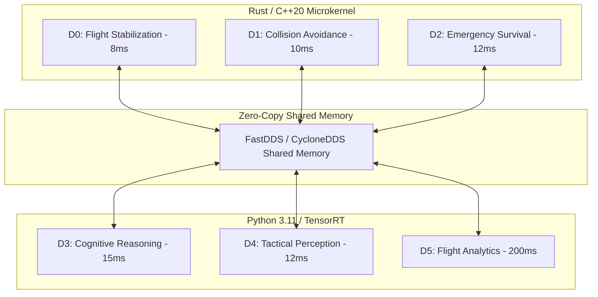

# Drone-N1 (Altaria OS) Master Strategic Expansion Plan

## Executive Vision

**Drone-N1 (powered by the Altaria OS kernel)** is positioned to become the global standard for mission-centric autonomous aviation software. By operating directly above low-level flight controllers (PX4, ArduPilot), Drone-N1 solves the fundamental gap between hardware stabilization and high-level mission intelligence.

This **Master Strategic Expansion Plan** outlines the 5-pillar roadmap to scale Drone-N1 into a commercial, academic, and defense software powerhouse.

---

```
                                  +---------------------------------------+
                                  |     DRONE-N1 MASTER STRATEGIC PLAN     |
                                  +-------------------+-------------------+
                                                      |
         +--------------------+-----------------------+-----------------------+--------------------+
         |                    |                       |                       |                    |
         v                    v                       v                       v                    v
+------------------+ +------------------+   +-------------------+   +-------------------+ +------------------+
|   PILLAR 1:      | |   PILLAR 2:      |   |    PILLAR 3:      |   |    PILLAR 4:      | |   PILLAR 5:      |
| Dual-Use GTM &   | | C++20/Rust Core  |   | DO-178C DAL-A &   |   | Enterprise GCS &  | | IP, Licensing &  |
| Defense Strategy | | Microkernel      |   | Journal Submission|   | Fleet Telemetry   | | Open Ecosystem   |
+------------------+ +------------------+   +-------------------+   +-------------------+ +------------------+
```

---

## Pillar 1: Dual-Use Commercial & Defense Strategy (Go-To-Market)

### 1.1 Targeted Market Verticals
1. **Commercial Logistics & BVLOS Delivery**:
   * *Target:* FAA Part 135 & EASA SORA certified Beyond Visual Line of Sight (BVLOS) operations.
   * *Feature Requirement:* Continuous risk intelligence tracking and automated emergency land/RTL routing under 50ms.
2. **Industrial & Offshore Infrastructure Inspection**:
   * *Target:* Oil & gas platforms, wind turbine arrays, high-voltage power lines.
   * *Feature Requirement:* GPS-denied visual-inertial navigation under heavy wind turbulence ($> 12\,\text{m/s}$).
3. **Defense & Tactical Swarm Operations**:
   * *Target:* Reconnaissance, GPS-spoofed battlefield environments, multi-drone collaborative missions.
   * *Feature Requirement:* Zero-Trust ECDSA command verification, anti-jamming AFKF-SPRT, dynamic mesh swarm communication.

### 1.2 OEM & Edge Compute Integration Partners
- **Flight Computers:** Pixhawk FMUv6X, Holybro Durandal, CubePilot Cube Orange, Auterion Skynode.
- **Edge AI Accelerators:** NVIDIA Jetson Orin Nano / Orin AGX, NXP i.MX8M Plus, Qualcomm RB5.

---

## Pillar 2: Software Architecture & Engineering Scaling (V2.0 Core Kernel)



### 2.1 C++20 / Rust Microkernel Migration
- Re-architect hard real-time domains ($\mathcal{D}_0 - \mathcal{D}_2$) from Python into a compiled **Rust / C++20 microkernel**.
- **Target Performance:** Bound worst-case execution time (WCET) to under $1.0\,\text{ms}$ with zero heap allocations post-initialization.

### 2.2 Decentralized Swarm Consensus Protocol
- Implement decentralized multi-agent flocking and collision avoidance based on Distributed Model Predictive Control (D-MPC).
- Enable mesh peer-to-peer telemetry sharing across fleets of 10 to 100 multirotors.

### 2.3 Automated HITL CI/CD Pipeline
- Set up a physical hardware test bench containing 4x Jetson Orin Nano boards connected to Pixhawk 6C flight controllers via hardware UART.
- Run continuous integration flight simulations (1,000 automated SITL/HITL trials per pull request).

---

## Pillar 3: Regulatory Certification & Top-Tier Academic Publishing

### 3.1 DO-178C DAL-A & ARP4754A Certification File
- **Tool Qualification (DO-330):** Qualify compiler toolchains and automated test verification suites.
- **Formal Verification:** Use SPARK Ada / Frama-C static analyzers to mathematically prove the absence of runtime exceptions in the AI Safety Shield.
- **Traceability Artifacts:** Maintain 100% bidirectional traceability between System Safety Assessment (SSA) requirements, high-level code, and flight test data.

### 3.2 Top-Tier Academic Journal Submissions
- **Target Venues:**
  1. *IEEE Transactions on Robotics (T-RO)*
  2. *Science Robotics*
  3. *IEEE Transactions on Automation Science and Engineering (T-ASE)*
- **Publication Strategy:** Focus paper submissions on empirical flight validation, AFKF-SPRT mathematical convergence proofs, and mixed-criticality scheduling bounds.

---

## Pillar 4: Enterprise Ground Control & Telemetry Ecosystem

### 4.1 Distributed Telemetry Lakehouse
- Deploy a high-throughput **ClickHouse** telemetry store capable of ingesting 100,000 events/second across multi-drone fleets.
- Implement WebRTC H.264/H.265 ultra-low latency video streaming into the React 3D GCS dashboard.

### 4.2 AI Mission Studio & Digital Twin Preview
- Build a no-code visual mission DAG drag-and-drop node graph.
- Allow operators to preview candidate flight plans in a 1-millisecond fast-forward 3D digital twin sandbox before pushing MAVLink commands to physical aircraft.

---

## Pillar 5: IP, Licensing, and Financial Sustainability

### 5.1 Open-Core Business Model

```
+-------------------------------------------------------------------+
|                        COMMERCIAL ENTERPRISE                      |
|  - Altaria Defense Swarm Engine                                   |
|  - DO-178C DAL-A Certification Evidence Package                   |
|  - ClickHouse Fleet Telemetry Lakehouse                           |
|  - Premium 24/7 Mission Support                                   |
+-------------------------------------------------------------------+
                                  ^
                                  | Dual License / Proprietary
+---------------------------------+---------------------------------+
|                         OPEN-SOURCE CORE                          |
|  - Altaria OS Base Kernel & Scheduler                             |
|  - Basic AFKF Sensor Takeover                                     |
|  - Gazebo SITL Simulation Sandbox                                 |
+-------------------------------------------------------------------+
```

### 5.2 Intellectual Property (IP) Portfolio
- File patent applications covering:
  1. *System and Method for Sub-15ms Sensor Takeover in Autonomous Flight using Sequential Probability Ratio Testing.*
  2. *Real-Time Counterfactual Fast-Forward Digital Twin Simulation in Mixed-Criticality Embedded Systems.*
  3. *Hardware-Agnostic AI Safety Interceptor for MAVLink Flight Controllers.*

---

## Execution Milestones

| Quarter | Milestone Focus | Target Deliverable |
| :--- | :--- | :--- |
| **Q1 2027** | **Rust Microkernel & Zero-Copy API** | Sub-1ms $\mathcal{D}_0$ kernel & WebSockets binary streaming |
| **Q2 2027** | **Physical HITL Outdoor Flight Bench** | Hexacopter field testing in $12\,\text{m/s}$ real winds |
| **Q3 2027** | **DO-178C DAL-A Evidence Audit** | Complete certification package for FAA Part 135 approval |
| **Q4 2027** | **Swarm Intelligence & Enterprise Release**| Multi-drone fleet orchestration & commercial GTM launch |
