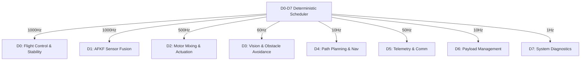
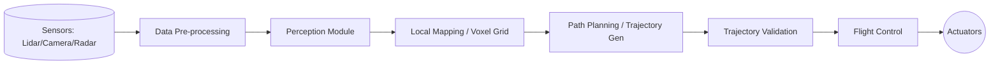
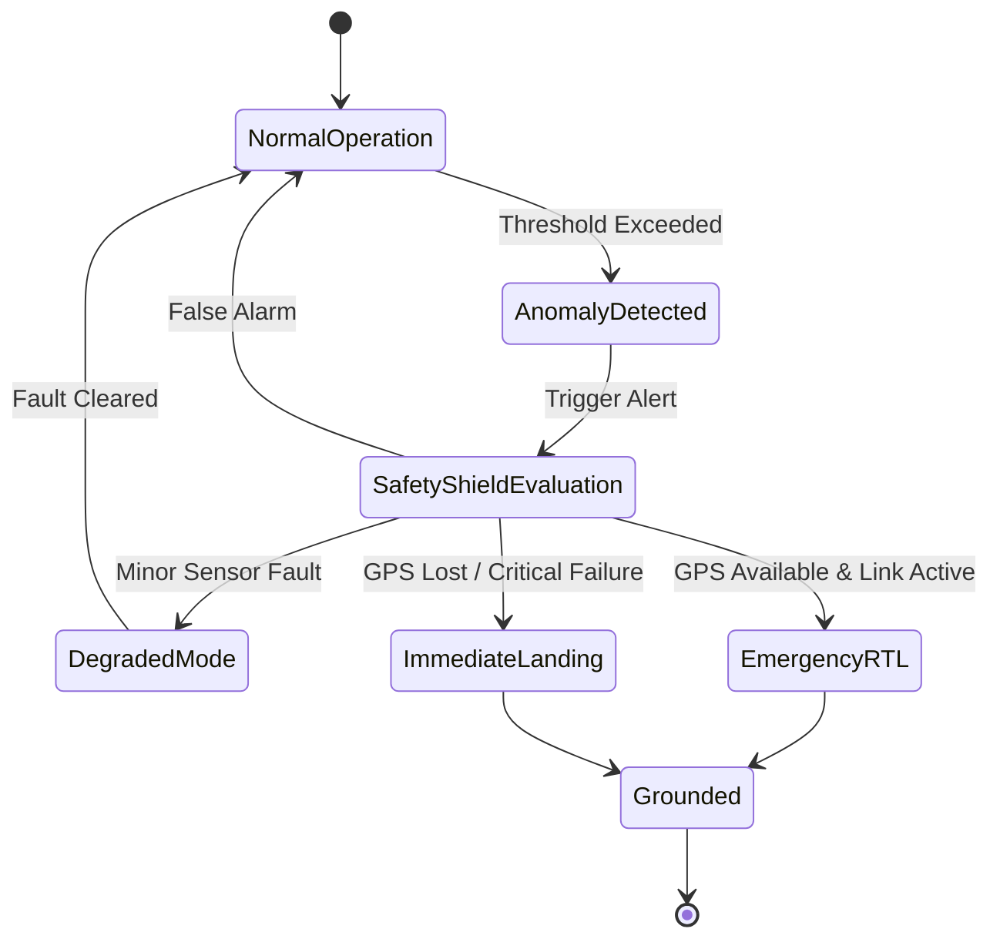
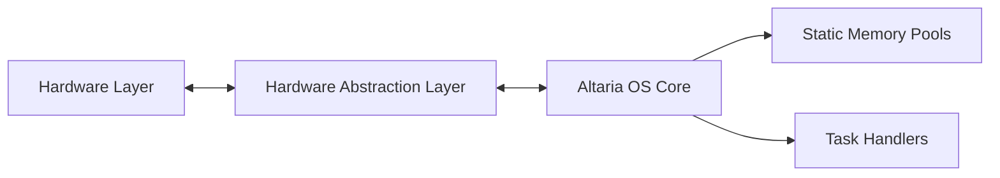

# System Architecture Specification for Drone-N1 (Altaria OS)

## 1. 8-Subsystem Stack
The Altaria OS consists of 8 distinct subsystems (D0 through D7) managed by a strict deterministic scheduler. This scheduler ensures temporal isolation and predictable execution for all real-time tasks, bounding the worst-case execution time (WCET) for safety-critical components.

## 2. Cognitive Loop & Autonomy
The cognitive loop manages high-level autonomy, fusing perception data into actionable waypoints and velocity commands. This loop operates asynchronously from the core flight control to prevent computational bottlenecks.

## 3. Fail-Safe Recovery Flow
The Safety Shield continuously monitors system invariants. In the event of a critical subsystem failure, it overrides standard operations. It maintains strict DAL-A compliance by executing on a verified isolated partition.

## 4. Hardware Interaction & Memory Model
Memory allocation in Altaria OS is strictly static. No dynamic memory allocation (`malloc`, `free`) is permitted after system initialization to prevent memory fragmentation and out-of-memory errors during runtime.

