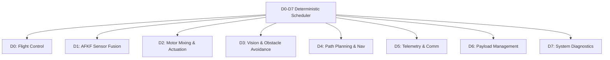
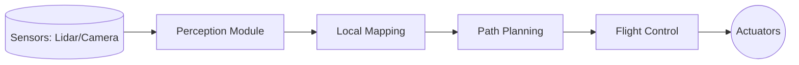
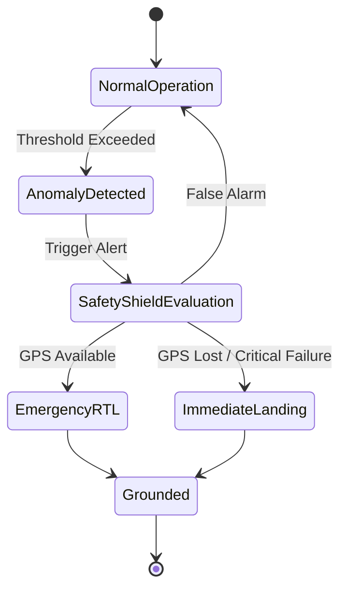

# System Architecture Specification for Drone-N1 (Altaria OS)

## 1. 8-Subsystem Stack
The Altaria OS consists of 8 distinct subsystems (D0 through D7) managed by a strict deterministic scheduler.

## 2. Cognitive Loop
The cognitive loop manages the high-level autonomy, fusing perception data into actionable waypoints and velocity commands.

## 3. Fail-Safe Recovery Flow
The Safety Shield continuously monitors the system. In the event of a critical subsystem failure, it overrides standard operations.

